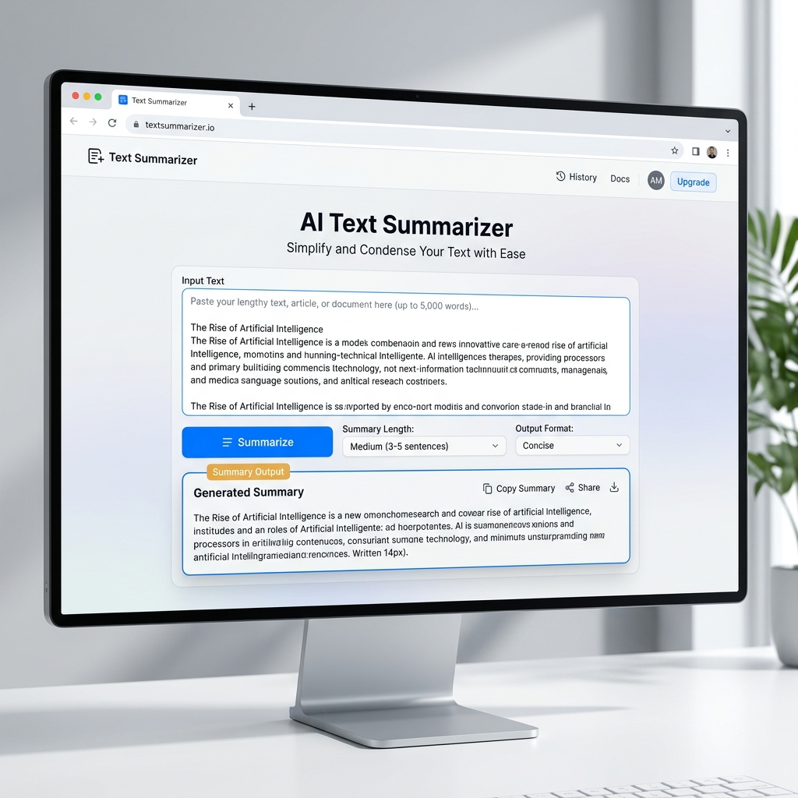

#  AI-Powered Text Summarizer



A professional, end-to-end Machine Learning application that provides high-quality text summarization using fine-tuned **T5 Transformer** models. This project features a modern, responsive web interface built with **FastAPI** and a premium design system.

##  Key Features

- **Fine-Tuned T5 Model**: Optimized specifically for dialogue and long-form text summarization.
- **FastAPI Backend**: High-performance asynchronous API with automatic OpenAPI (Swagger) documentation.
- **Modern UI/UX**: Clean, minimalist interface with a focus on readability and smooth user experience.
- **Real-time Inference**: Quick summary generation using Hugging Face Transformers.
- **Robust Preprocessing**: Custom cleaning pipeline to handle noisy text data.

##  Technical Stack

### **Frontend**
- **HTML5 & CSS3**: Vanilla implementation with a custom design system using HSL color tokens and Inter typography.
- **JavaScript (ES6+)**: Asynchronous fetch API for seamless interaction with the backend without page reloads.

### **Backend**
- **FastAPI**: A modern, fast (high-performance) web framework for building APIs with Python.
- **Pydantic**: Data validation and settings management using Python type annotations.
- **Uvicorn**: A lightning-fast ASGI server implementation.

### **Machine Learning**
- **Transformers (Hugging Face)**: Utilized the T5-Small architecture for sequence-to-sequence summarization.
- **PyTorch**: Deep learning framework used for model inference and training.
- **Fine-Tuning**: The model was fine-tuned on the **SAMSum dataset**, which consists of over 14,000 messenger-like conversations with their corresponding summaries.

##  Model Training & Fine-Tuning

The model underwent a rigorous fine-tuning process:
1. **Dataset Selection**: Chose the SAMSum dataset to better understand conversational context and informal language.
2. **Preprocessing**: Implemented a cleaning pipeline to remove HTML tags, normalize whitespace, and handle line breaks.
3. **Tokenization**: Used the `T5Tokenizer` with a `max_length` of 512 for input and 150 for target summaries.
4. **Training**: Leveraged the `Seq2SeqTrainer` with beam search optimization (`num_beams=4`) to ensure high-quality output generation.

##  Project Structure

```text
text-summarizer-app/
├── app/                  # FastAPI Application logic
│   ├── static/           # Static assets (CSS, JS, Images)
│   ├── templates/        # HTML Templates (Jinja2)
│   ├── main.py           # Entry point for the API
│   ├── models.py         # Pydantic request/response models
│   └── utils.py          # ML utility functions and processing
├── data/                 # Dataset used for training (SAMSum)
├── models/               # Fine-tuned T5 model checkpoints
├── research/             # Jupyter notebooks and experiments
├── requirements.txt      # Project dependencies
└── Dockerfile            # Containerization support
```

## ⚙️ Installation & Setup

1. **Clone the repository**:
   ```bash
   git clone https://github.com/MANADIP/ai-text-summarizer-app.git
   cd ai-text-summarizer-app
   ```

2. **Install dependencies**:
   ```bash
   pip install -r requirements.txt
   ```

3. **Run the application**:
   ```bash
   uvicorn app.main:app --reload
   ```

4. **Access the App**:
   Open `http://127.0.0.1:8000` in your browser.

##  License
This project is licensed under the MIT License - see the [LICENSE](LICENSE) file for details.

---
*Created with ❤️ by Manadip*
